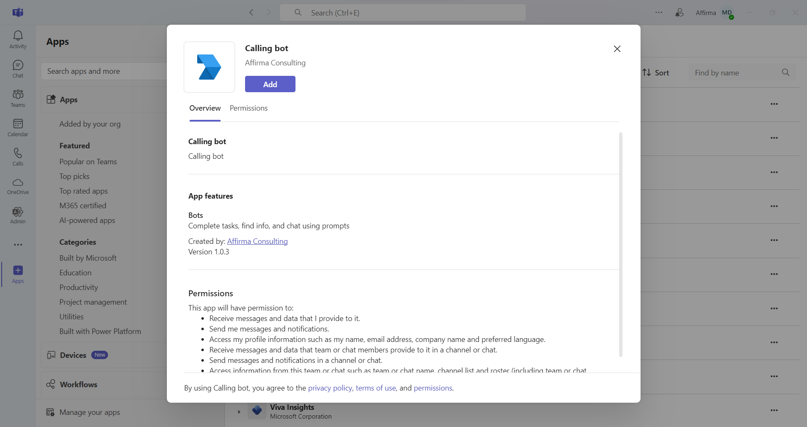
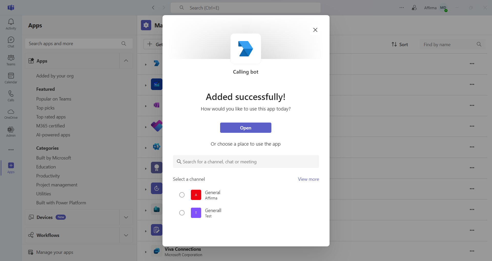
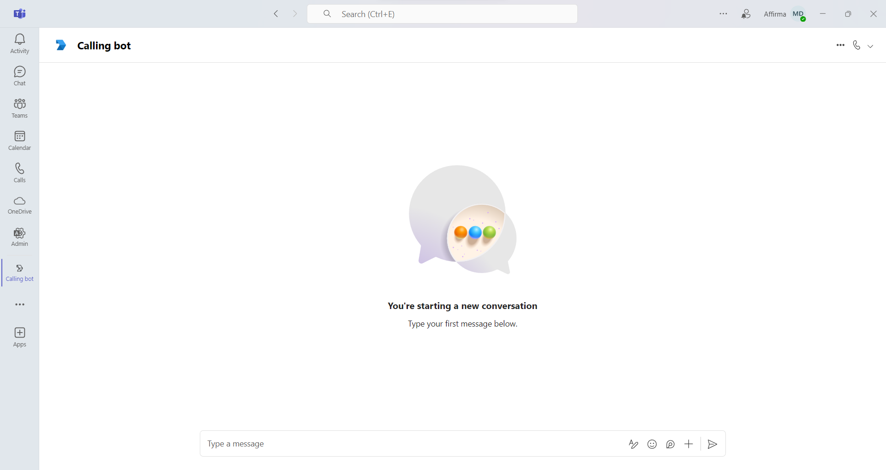
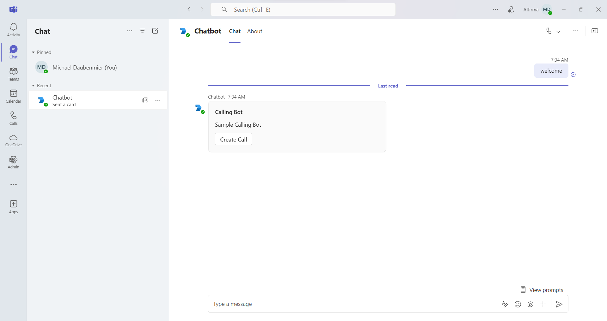
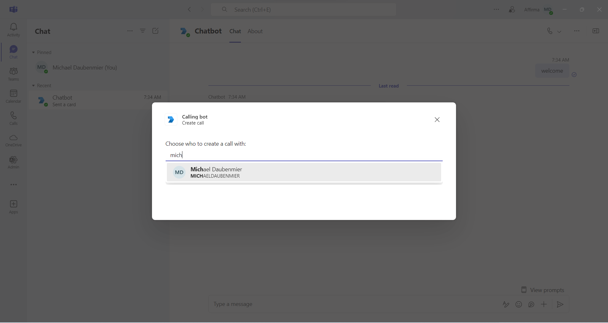
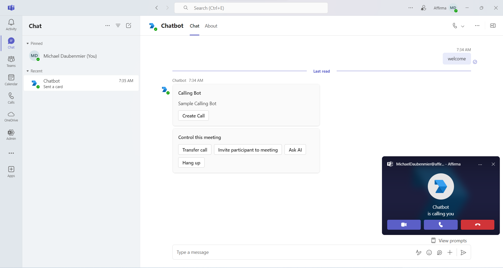
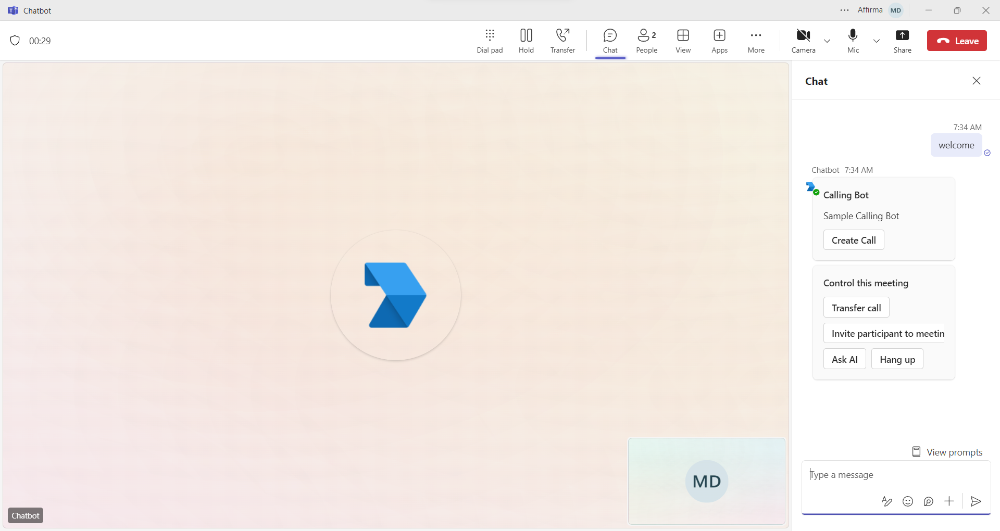
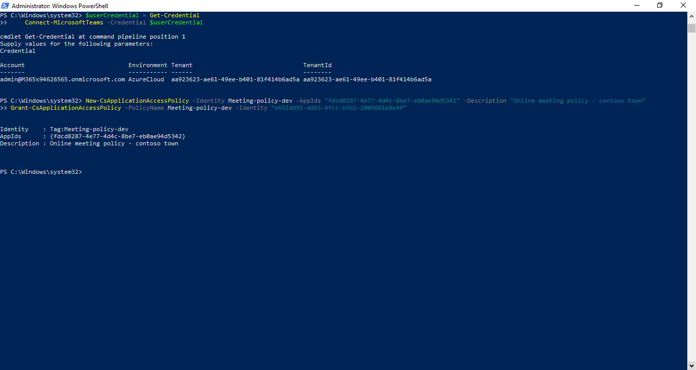
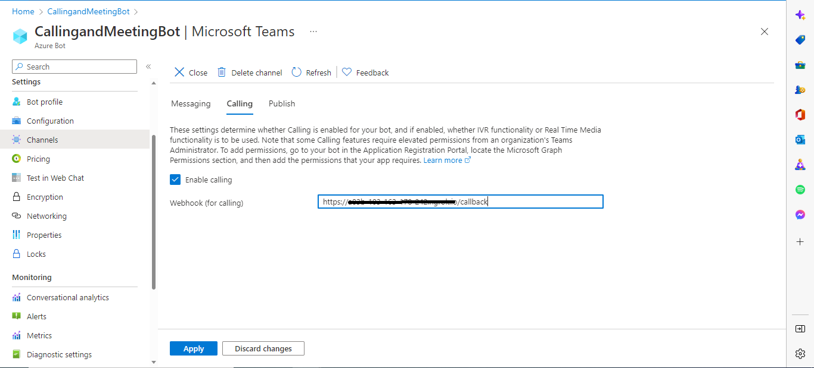
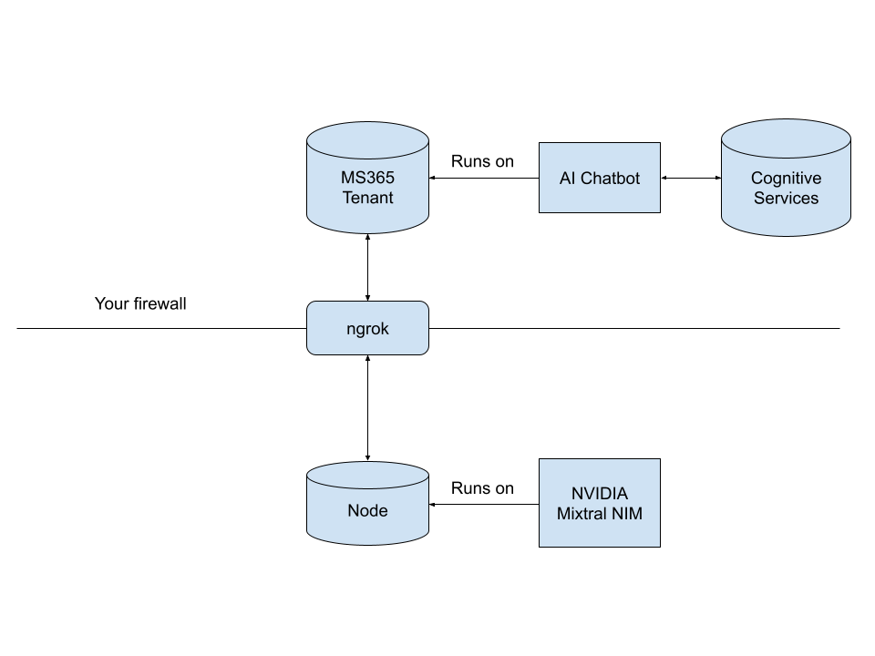

# Unlocking-Innovation-with-NVIDIA-and-Microsoft
Build an Intelligent Teams Chatbot with Microsoft Azure and NVIDIA Nim


# Introduction 
This project will show you how to implement a Microsoft Teams chatbot that uses NVIDIA's [Mixtral 8x7b-instruct NIM](https://build.nvidia.com/mistralai/mixtral-8x7b-instruct), Azure's Cognitive Services, and Azure Bot Framework in order to respond to spoken prompts and provide answers. The architecture is relatively simple, and the relevant code isn't complex, which shows you how easy it is to get these technologies to work together. The setup takes a little bit of time, but we've provided you with a detailed walkthrough to help you get the services you need up and running.

This proof of concept is based on Microsoft's [Calling Bot](https://github.com/officedev/microsoft-teams-samples/tree/main/samples/bot-calling-meeting/csharp) tutorial.

## UI 
To start, you'll install the app package in Teams. Click the Apps -> Manage your apps, then click "Upload an app" in the top nav bar, on the left hand side. You'll be able to upload a zip containing the bot's manifest and thumbnails. From there, you can add the Calling Bot.



After you install it, you'll get the Added successfully dialog, and you can open the bot from there.



This will bring you to a chat window with the bot. 



You can type anything, and the bot will give you a welcome card that allows you to start a meeting.



Click "Create call", and you'll get a dialog allowing you to invite people to a call. Invite yourself, and anyone else you want to show off to.



At this point, the bot will call you.



Answer the call, and at this point, you can start asking the bot questions verbally! It will respond verbally, and you can have a nice conversation.



# Getting Started

This section will show you how to get the bot up and running. If you're just interested in how everything fits together, you can skip ahead to the ["How it works"](#how-it-works) section.

## Prerequisites
- The latest version of [NodeJS](https://nodejs.org/en) (v22.13.0 as of the time of writing)
- [Visual Studio](https://visualstudio.microsoft.com/vs/community/)
- [Office 365 tenant](https://developer.microsoft.com/en-us/microsoft-365/dev-program)
- Microsoft Teams is installed and you have an account
- [.NET Core SDK](https://dotnet.microsoft.com/download) version 6.0
- [dev tunnel](https://learn.microsoft.com/en-us/azure/developer/dev-tunnels/get-started?tabs=windows) or [ngrok](https://ngrok.com/) latest version or equivalent tunnelling solution
- [PowerShell](https://learn.microsoft.com/en-us/powershell/scripting/install/installing-powershell-on-macos) if on macOS (`brew install --cask powershell`)
- an [NGC API Key](https://docs.nvidia.com/ai-enterprise/deployment/spark-rapids-accelerator/latest/appendix-ngc.html)


## Setup

> Note these instructions are for running the sample on your local machine, the tunnelling solution is required because
> the Teams service needs to call into the bot.

1. Clone the repository

   ```bash
   git clone <<Repo URL here>>
   ```

2. If you are using Visual Studio

   - Launch Visual Studio
   - File -> Open -> Project/Solution
   - Navigate to `samples/bot-calling-meeting/csharp` folder
   - Select `CallingBotSample.csproj` file

3. Run ngrok - point to port 3978

   ```bash
   ngrok http 3978 --host-header="localhost:3978"
   ```

   Alternatively, you can also use the `dev tunnels`. Please follow [Create and host a dev tunnel](https://learn.microsoft.com/en-us/azure/developer/dev-tunnels/get-started?tabs=windows) and host the tunnel with anonymous user access command as shown below:

   ```bash
   devtunnel host -p 3978 --allow-anonymous
   ```

## Register Azure AD application

Register one Azure AD application in your tenant's directory for the bot and tab app authentication.

1. Log in to the Azure portal from your subscription, and go to the "App registrations" blade [here](https://portal.azure.com/#blade/Microsoft_AAD_IAM/ActiveDirectoryMenuBlade/RegisteredApps). Ensure that you use a tenant where admin consent for API permissions can be provided.

2. Click on "New registration", and create an Azure AD application.

3. **Name:** The name of your Teams app - if you are following the template for a default deployment, we recommend "App catalog lifecycle".

4. **Supported account types:** Select "Accounts in any organizational directory"

5. Leave the "Redirect URL" field blank.

6. Click on the "Register" button.

7. When the app is registered, you'll be taken to the app's "Overview" page. Copy the **Application (client) ID**; we will need it later. Verify that the "Supported account types" is set to **Multiple organizations**.

8. On the side rail in the Manage section, navigate to the "Certificates & secrets" section. In the Client secrets section, click on "+ New client secret". Add a description for the secret and select Expires as "Never". Click "Add".

9. Once the client secret is created, copy its **Value**, please take a note of the secret as it will be required later.

   At this point you have 3 unique values:

   - Application (client) ID which will be later used during Azure bot creation
   - Client secret for the bot which will be later used during Azure bot creation
   - Directory (tenant) ID

   We recommend that you copy these values into a text file, using an application like Notepad. We will need these values later.

10. Under left menu, navigate to **API Permissions**, and make sure to add the following permissions of Microsoft Graph API > Application permissions:

    - `Calls.AccessMedia.All`
    - `Calls.Initiate.All`
    - `Calls.InitiateGroupCall.All`
    - `Calls.JoinGroupCall.All`
    - `Calls.JoinGroupCallAsGuest.All`
    - `OnlineMeetings.ReadWrite.All`

    Click on Add Permissions to commit your changes.

11. If you are logged in as the Global Administrator, click on the "Grant admin consent for <%tenant-name%>" button to grant admin consent else, inform your admin to do the same through the portal or follow the steps provided here to create a link and send it to your admin for consent.

12. Global Administrator can grant consent using following link: [https://login.microsoftonline.com/common/adminconsent?client_id=](https://login.microsoftonline.com/common/adminconsent?client_id=)<%appId%>
13. [Install Microsoft Teams PowerShell Module](https://learn.microsoft.com/en-us/microsoftteams/teams-powershell-install). For basic install, run `Find-Module MicrosoftTeams | Import-Module` in PowerShell, or check the link for detailed other advanced installs.
    - For macOS, the following command should be executed in [PowerShell](https://learn.microsoft.com/en-us/powershell/scripting/install/installing-powershell-on-macos) (`brew install --cask powershell`).
14. Create a policy for a demo tenant user for creating the online meeting on behalf of that user using the following PowerShell script
    1. In order to find the "object-id-of-the-user-to-whom-policy-needs-to-be-granted"
    2. Log in to portal.azure.com with your new teams tenant account.
    3. search for "Microsoft Entra ID" in the search bar
    4. search for your account in the search bar on the Entra ID page ("Search your tenant" field)
    5. click on your name
    6. under "User principal name" there will be  "Object ID"

    ```powershell
    # Find-Module MicrosoftTeams | Import-Module
    # Call Connect-MicrosoftTeams using no parameters to open a window allowing for MFA accounts to authenticate
    Connect-MicrosoftTeams
    New-CsApplicationAccessPolicy -Identity “<<policy-identity/policy-name>>” -AppIds "<<microsoft-app-id>>" -Description "<<policy-description>>"
    Grant-CsApplicationAccessPolicy -PolicyName “<<policy-identity/policy-name>>” -Identity "<<object-id-of-the-user-to-whom-policy-needs-to-be-granted>>"
    ```

    e.g.:

    ```powershell
      # Import-Module MicrosoftTeams
      Connect-MicrosoftTeams

      New-CsApplicationAccessPolicy -Identity Meeting-policy-dev -AppIds "d0bdaa0f-8be2-4e85-9e0d-2e446676b88c" -Description "Online meeting policy - contoso town"
      Grant-CsApplicationAccessPolicy -PolicyName Meeting-policy-dev -Identity "782f076f-f6f9-4bff-9673-ea1997283e9c"
    ```

    

15. Update `PolicyName`, `microsoft-app-id`, `policy-description`, `object-id-of-the-user-to-whom-policy-need-to-be-granted` in powershell script.
16. Run `Windows Powershell PSI` as an administrator and execute above script.
17. Run following command to verify policy is create successfully or not: `Get-CsApplicationAccessPolicy -Identity Meeting-policy-dev`

## Setup Bot Service

1. In Azure portal, create a [Azure Bot resource](https://docs.microsoft.com/en-us/azure/bot-service/bot-service-quickstart-registration)
2. Select Type of App as "Multi Tenant"
3. Select Creation type as "Use existing app registration"
4. Use the copied App Id and Client secret from above step and fill in App Id and App secret respectively.
5. Click on 'Create' on the Azure bot.
6. Go to the created resource, ensure that you've [enabled the Teams Channel](https://learn.microsoft.com/en-us/azure/bot-service/channel-connect-teams?view=azure-bot-service-4.0)
7. In Settings/Configuration/Messaging endpoint, enter the current `https` URL you have given by running the tunneling application. Append with the path `/api/messages`
8. Select the Calling tab on the Teams channel page. Select Enable calling, and then update Webhook (for calling) with your HTTPS URL (`https://<your_tunnel_domain>/callback`) where you receive incoming notifications.
   For example `https://contoso.com/teamsapp/callback`
   
9. Save your changes.

### Configuring the sample

1. **_Update appsettings.json for calling Bot_**

   ```json
   {
     "MicrosoftAppId": "<<microsoft-app-id>>",
     "MicrosoftAppPassword": "<<microsoft-app-client-secret>>",
     "AzureAd": {
       "Instance": "https://login.microsoftonline.com/",
       "TenantId": "<<tenant-Id>>",
       "ClientId": "<<microsoft-app-id>>",
       "ClientSecret": "<<microsoft-app-client-secret>>"
     },
     "Bot": {
       "AppId": "<<microsoft-app-id>>",
       "AppSecret": "<<microsoft-app-client-secret>>",
       "PlaceCallEndpointUrl": "https://graph.microsoft.com/v1.0",
       "BotBaseUrl": "https://<<subdomain>>.ngrok-free.app",
       "GraphApiResourceUrl": "https://graph.microsoft.com",
       "MicrosoftLoginUrl": "https://login.microsoftonline.com/",
       "RecordingDownloadDirectory": "temp",
       "CatalogAppId": "<<microsoft-app-id>>"
     },
     "CognitiveServices": {
       "Enabled": false,
       "SpeechKey": "<<cognitive-speech-key>>",
       "SpeechRegion": "<<cognitive-speech-region>>",
       "SpeechRecognitionLanguage": "<<cognitive-speech-language>>"
     },
     "Users": {
       "UserIdWithAssignedOnlineMeetingPolicy": "<<object-id-of-the-user-to-whom-online-meeting-policy-has-been-granted>>"
     }
   }
   ```

   - Update `microsoft-app-id`, `tenant-Id`, `microsoft-app-client-secret` with your app's client id and client secret registered in demo tenant.
   - Update `BotBaseUrl` with your `tunnel` URL.
   - Update `object-id-of-the-user-to-whom-online-meeting-policy-has-been-granted` with the ID of the user who has had the policy assigned to them above

   **Create a Cognitive Services resource using the Azure portal:**
   [Create Cognitive Services resource](https://learn.microsoft.com/en-us/azure/cognitive-services/cognitive-services-apis-create-account?tabs=multiservice%2Canomaly-detector%2Clanguage-service%2Ccomputer-vision%2Cwindows)

   - Update `cognitive-speech-key` replace `your-key`with one of the keys for your resource.
   - Update `cognitive-speech-key` replace `your-region`with one of the regions for your resource.
   - Update `cognitive-speech-language` replace `your-language`with one of the language for your resource. See BCP-47 locale values available to speech-to-text at [Speech-to-text](https://learn.microsoft.com/en-us/azure/ai-services/speech-service/language-support?tabs=stt#speech-to-text).

2. **_This step is specific to Teams_**
   - **Edit** the `manifest.json` contained in the `AppManifest` folder to replace your Microsoft App Id (that was created when you registered your bot earlier) _everywhere_ you see the place holder string `<<YOUR-MICROSOFT-APP-ID>>` (depending on the scenario the Microsoft App Id may occur multiple times in the `manifest.json`)
   - **Edit** the `manifest.json` for `validDomains`, replace `<<domain-name>>` with base Url domain. E.g. if you are using ngrok it would be `https://1234.ngrok-free.app` then your domain-name will be `1234.ngrok-free.app` and if you are using dev tunnels then your domain will be like: `12345.devtunnels.ms`.
   - **Zip** up the contents of the `AppManifest` folder to create a `manifest.zip` (Make sure that zip file does not contains any subfolder otherwise you will get error while uploading your .zip package)
   - **Upload** the `manifest.zip` to Teams (In Teams Apps/Manage your apps click "Upload an app". Browse to and Open the .zip file. At the next dialog, click the Add button.)
   - Add the app to personal/team/groupChat scope (Supported scopes)

**Note**: If you are facing any issue in your app, please uncomment [this](https://github.com/OfficeDev/Microsoft-Teams-Samples/blob/main/samples/bot-calling-meeting/csharp/Source/CallingBotSample/AdapterWithErrorHandler.cs#L22) line and put your debugger for local debug.

3. **_Update NimController.js with your NGC API key_**
    - On line 5, replace <<NGC-API-Key>> with your key.

### Build
At this point, you can run the bot locally. Just run it using IIS Express.

### Build the Teams app package
Just zip the contents of Source/CallingBotSample/AppManifest into a zip. You can then upload that zip into Teams in order to install the bot. Make sure all the files in the AppManifest
directory are at the root of the zip file.

# How it works


The core of the bot is a Node application running locally. The application uses OpenAI's library to talk to Mixtral in the cloud. We use ngrok to provide a tunnel to your local machine, so that the
chatbot, running on your MS365 tenant in Azure, can talk to the NIM. The chatbot uses Azure's bot service to connect to Teams and uses Microsoft Graph to start calls and respond to chats. When the
chatbot receives voice input, it uses Cognitive Services to convert speech into text, and the Nim's text response back into speech, which it then plays through Teams.
